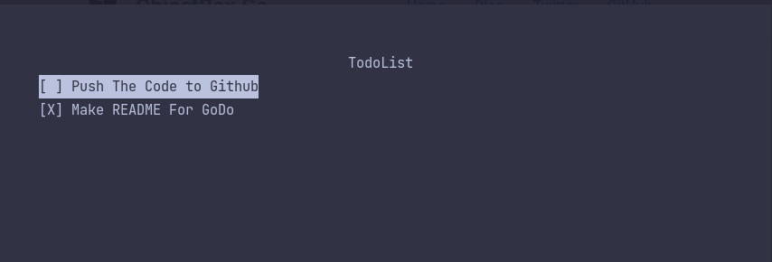

# __GO__(lang)__DO__(it)
##### A simple todo app written in go, (go)ncurses and objectbox.

| Key     | Action               |
| ------- | -------------------- |
| `space` | Toggle Check           | 
| `j`     | Move cursor up         |
| `k`     | Move cursor down       |
| `o`     | Add New Todo           |
| `d`     | Delete Selected Todo   |
| `q`     | Quit App               |
